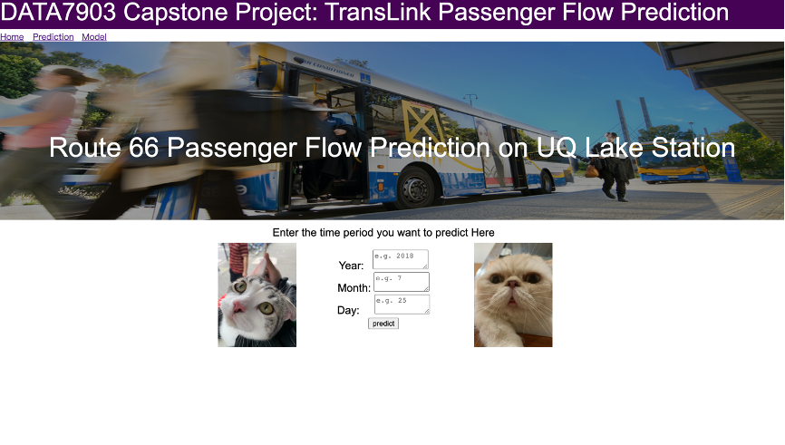
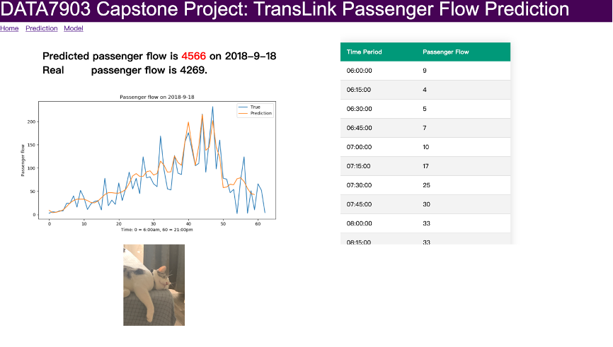

# Passenger Flow Prediction
The capstone project.

## Website

An interactive website based on flask for users to analyze passenger flow prediction. 

### Prediction Page



### Result Page



## Functionality

Training a suitable neural network model requires many attempts. This contains a lot of repeated steps. Therefore, this project also designed 3 functions to encapsulate these operations. This makes training LSTM easier and optimizes code readability.

The first part is the data processing part. As shown in the figure, the data shape required by the LSTM model is specific. You need to manually convert the original data into the shape required by LSTM.

```python
def dataProcessing(dayNum, dataset):
    """
    A method for users to make multivariate time series for LSTM
    @param: dayNum, the number of days you want to use as the training set.
    @param: dataset, the period you want to predict, s.t. study_weekend, study_weekday, 
                                                          holiday_weekend, holiday_weekday
                     Dataset should be time series.
                     Dataset features(order important): PassengerFlow, TMax, TMin, Rain
    @return: X_train, y_train, X_test, y_test.  Training set 70%, Testing set 30% 
    """
    time_step =  dayNum * 15 * 4
    scaler = MinMaxScaler(feature_range=(0, 1))
    scaled = scaler.fit_transform(dataset)
    a = np.zeros([scaled.shape[0]-time_step + 1, time_step ,4])
    for i in range(scaled.shape[0]-time_step+1):
        for j in range(time_step):
            a[i][j] = scaled[i + j]
    y = np.zeros(scaled.shape[0])
    for i in range(scaled.shape[0]):
        y[i] = scaled[i][0]
    size = round(a.shape[0]*0.7)
    
    #split train and test sets
    X_train = a[:size]
    X_test = a[size:-1]
    y_train = y[time_step:size+time_step]
    y_test = y[size+time_step:]
    
    return X_train, y_train, X_test, y_test
```


The second part is model building. This function needs the number of layers, the number of neurons, batch size, epoch and other neural network parameters as inputs, and then return the LSTM model designed according to the parameters and give its loss plot for checking over-fitting or under-fitting.

```python
def myLSTM(X_train, y_train, layerNum, neuralNum, batchSize, epochs):
    """
    A well-designed method for users to create a LSTM model espicially for 
    Route 66 UQ Lake Station Passenger Flow Prediction.
    
    @param: X_train, training features
    @param: y_train, training labels
    @param: layerNum, the number of LSTM layers. Recommended between 1 and 3.
    @param: neuralNum, the number of neurals for every LSTM layer. Recommended between 0 and 500.
    @param: batchSize, the number of batchSize
    @param: epochs, the number of epochs
    @return: model, An LSTM model specified based on your input
    """
    # design network
    model = Sequential()
    model.add(LSTM(neuralNum, activation='relu',return_sequences=True,
                   input_shape=([X_train.shape[1], X_train.shape[2]])))
    for i in range(layerNum-1):
        model.add(LSTM(neuralNum, return_sequences=False))
    model.add(Dense(1))
    model.compile(loss='mse', optimizer='adam')
    
    earlystop_callback = EarlyStopping(monitor='val_loss', min_delta=0.0001, patience=20)
    
    history = model.fit(X_train, y_train, epochs=epochs, batch_size=batchSize, validation_data=(X_test, y_test), 
                        callbacks=[earlystop_callback],verbose=2, shuffle=False)
    
    plt.plot(history.history['loss'], label='train')
    plt.plot(history.history['val_loss'], label='test')
    plt.legend()
    plt.show()
    
    return model
```

The third part is the evaluation model. In the first part, in order to train LSTM models, data is normalized. However, when evaluating the model, data should be converted back to its original appearance to get the true RMSE value. At the same time, this function will also return a visualization of the true and predicted values.

```python
def evaluateMyLSTM(model, X_test, y_test, dataset):
    """
    A method for users to evaluate their LSTM model by myLSTM().
    Showing a plot of prediction by model and real values for visualization.
    
    @param model, the model returned by myLSTM().
    @param X_test, testing features.
    @param y_test, testing labels.
    @param dataset, the dataset to tell scaler how to restore data
    @return rmse, the real Root-mean-square deviation value of data which has been restored.
    """
    
    scaler = MinMaxScaler(feature_range=(0, 1))
    scaled = scaler.fit_transform(dataset)
    
    # make a prediction
    yhat = model.predict(X_test)
    inv_yhat = np.concatenate((yhat, np.zeros([y_test.shape[0], 3])), axis=1)
    y_true = np.concatenate((y_test.reshape([y_test.shape[0],1]), np.zeros([y_test.shape[0], 3])), axis=1)
    y_true = scaler.inverse_transform(y_true)[:,0]
    y_pre =  scaler.inverse_transform(inv_yhat)[:,0]
    
    #plot
    fig = plt.figure(figsize=(20, 5))
    ax = fig.add_subplot(111)
    ax.plot(y_true, label='true')
    ax.plot(y_pre, label='pred')
    ax.legend()
    
    rmse = math.sqrt(mean_squared_error(y_true, y_pre))
    print('Test RMSE: %.3f' % rmse)
    
    return rmse
```

